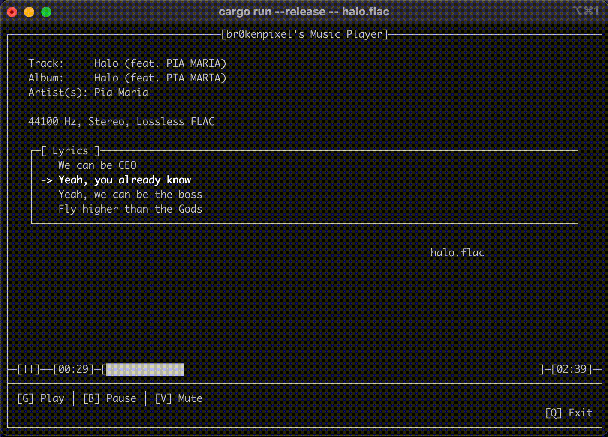

<p align="center">
  
</p>
<p align="center">
  <strong>br0kenpixel's Music Player</strong>
</p>
<p align="center">
  <em>A terminal based music player with time-synced lyrics support.</em>
</p>

# Intro
This is a remade version of the original, which was written in C.  
⚠️ Playlist features (`Next`, `Previous`) are not implemented yet.

## Parts
- [`src/main.rs`](src/main.rs) - Contains the main entry point. You should start exploring from here.
- [`src/audioinfo.rs`](src/audioinfo.rs) - Provides implementations for reading metadata from audio files.
- [`src/lyrics.rs`](src/lyrics.rs) - The lyrics "engine."
- [`src/player.rs`](src/player.rs) - Provides implementations for controlling the audio player.
- [`src/display.rs`](src/display.rs) - Provides a high-level abstraction layer for creating and managing the UI.

## Running
To run the player follow these steps:
1. Clone this repo
    - `git clone https://github.com/br0kenpixel/rustyplay`
2. Build the binary
    - `cargo build --release`
    - > ⚠️ It's highly recommended to build in release mode for better performance!
3. Run the binary like this:
    - `musicplayer [FILE]`
      - Example:
      - `musicplayer call_me.wav`

## Supported audio formats
- WAV
- OGG
- FLAC
  - > ~~⚠️ FLAC support is temporarily disabled due to issues with playback.~~
  - > ✅ FLAC playback has been fixed thanks to [this](https://docs.rs/rusty_audio/1.4.0/src/rusty_audio/lib.rs.html#85)!

## Supported systems:
As of now, it was only tested on macOS Monterey 12.6.1 (Intel). But theoretically it should work on any other OS, as all dependencies have cross-platform support.

# Dependencies
- [`rodio`](https://crates.io/crates/rodio)
  - An audio playback library
- [`sndfile`](https://crates.io/crates/sndfile)
  - Used to read metadata from audio files
- [`ncurses`](https://crates.io/crates/ncurses)
  - A popular terminal UI library
- [`pausable_clock`](https://crates.io/crates/pausable_clock)
  - Provides a pausable/resumable clock type
- [`json`](https://crates.io/crates/json)
  - Used to read lyrics files
- [`itertools`](https://docs.rs/itertools/latest/itertools/index.html)
  - Provides additional functions for iterating over arrays

# Lyrics
The time-synced lyrics are provided by Spotify/Musixmatch. In order to be able to use this feature, you must obtain a JSON file containing the time-synced lyrics data. Such data can be obtained by using either [`akashrchandran/spotify-lyrics-api`](https://github.com/akashrchandran/spotify-lyrics-api) or [`br0kenpixel/spotify-lyrics-api-rust`](https://github.com/br0kenpixel/spotify-lyrics-api-rust).
"End times" are also supported under certain conditions.

## Setting up
First, you need to use one of the tools listed above to obtain the lyrics data from Spotify. You'll need to save this data into a `.json` file. __This file must be located in the same directory as the audio file it "belongs" to!__  
For example, if you run `musicplayer Documents/Music/hello.wav` then `Documents/Music/hello.json` __must__ be a valid path and this file must contain the lyrics data obtained from Spotify. If this `.json` file does not exist, lyrics functionality will be disabled, however playback will work. If the `.json` file contains invalid data, the program will [`panic!()`](https://doc.rust-lang.org/std/macro.panic.html).

## "End time" support
So far I haven't noticed any lyrics data with `endTimeMs` set, however if the lyrics contain a line with a singe `♪` character, the lyrics parser will automatically "adjust" the lyrics data. This line will be ingnored and it's `startTimeMs` is changed to the previous line's `endTimeMs`.
For a quick overview, here's the snippet of the function that handles this "adjustment"/"cleanup":  
> ⚠️ This part of the code has been refactored, but the same algorithm applies. You can check the new implementation [here](https://github.com/br0kenpixel/rustyplay/blob/main/src/lyrics.rs#L64). If you want to check the old implementation, click [here](https://github.com/br0kenpixel/rustyplay/blob/2a923488ea6d2ca04e2118d81ef2030e4e6ef3b7/src/lyrics.rs#L92).
```rust
let mut result: Vec<LyricsLine> = Vec::new();

/* Parsing JSON... */

let mut index = 0;
while index < result.len() {
    let current = result[index].clone();
    if current.text == "♪" {
        let mut previous = result.get_mut(index - 1).unwrap();
        previous.end_time = Some(current.time);
        result.remove(index);
    } else {
        index += 1;
    }
}
```
If such a line is not found, this adjustment will not happen.

# Documentation
You can use `cargo doc` to generate the documentation.  
The "homepage" of the documentation is `target/doc/musicplayer/index.html`.

# FAQ/Troubleshooting
<details>
  <summary>Why are MP3s and M4As not supported if rodio supports them?</summary>
  Even though rodio can play these files, the problem is sndfile, which does not support those formats.
</details>
<details>
  <summary>Could the player automatically obtain lyrics?</summary>
  Yes, it could, however it would need to know the Spotify track ID of the song.
</details>
<details>
  <summary>How does the progress-bar work?</summary>
  This is explained in the documentation, you can either generate it with cargo (as shown above) or check out the code.
</details>
<details>
  <summary>I hear "crackling" when playing FLAC files.</summary>
  This issue should now be fixed, if you're still experiencing it, first check if you're using a debug build. If yes, such behaviour can be expected. Please use release builds instead.
</details>
<details>
  <summary>Why is it taking so long to open the player? ("Launching..." takes long)</summary>
  The player is designed to first load all necessary content and only then start the UI. This design may increase startup time, but makes the player more responsive when handling the UI and user input. This way, the player is only doing one specific thing at once. Additionally, you should check if you're using a debug build, if yes, you should expect long startup times (15-20 secs). Please use release builds instead.
</details>
